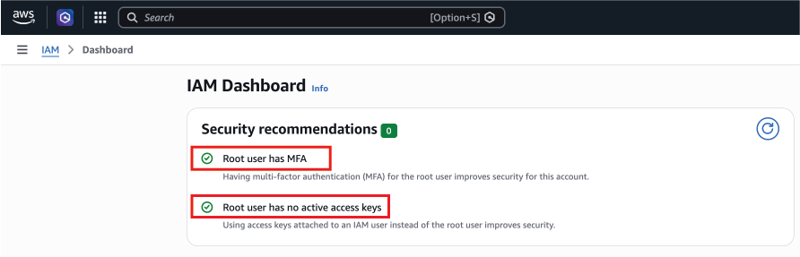
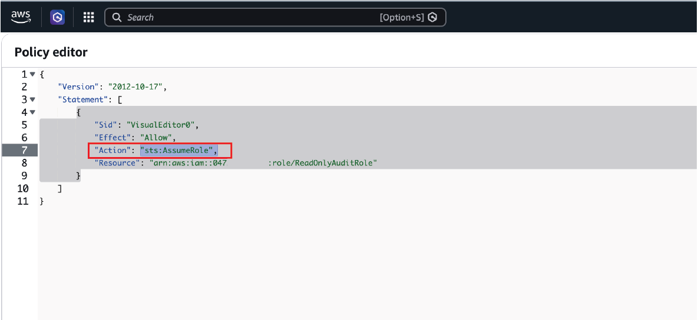
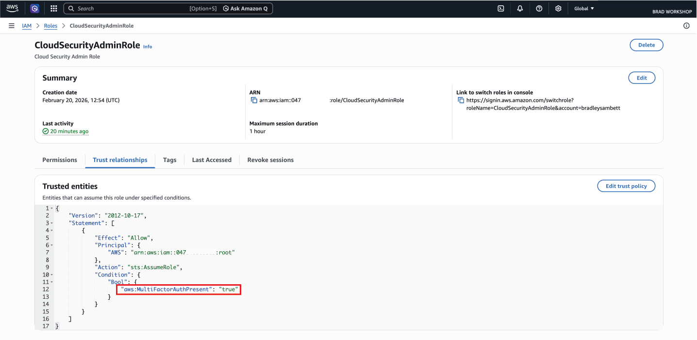
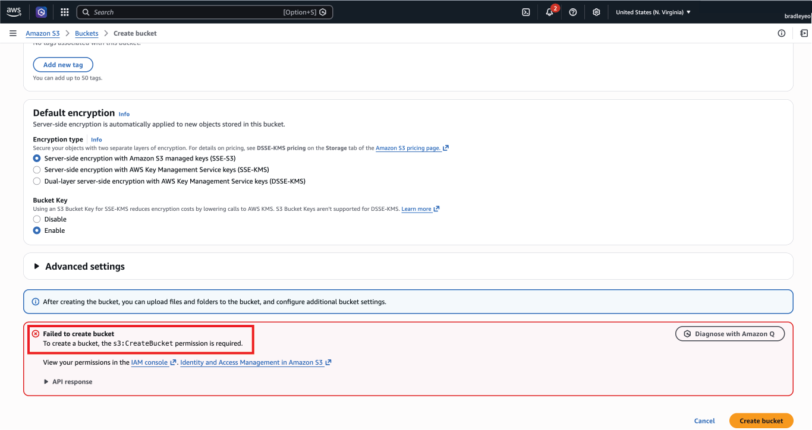
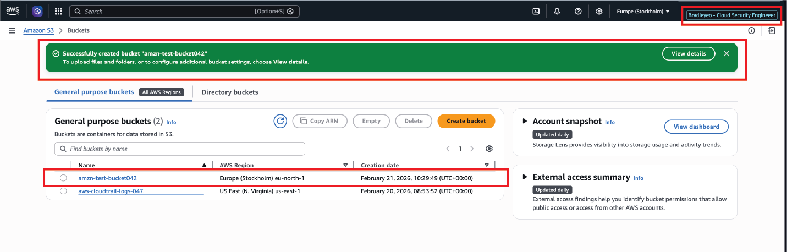
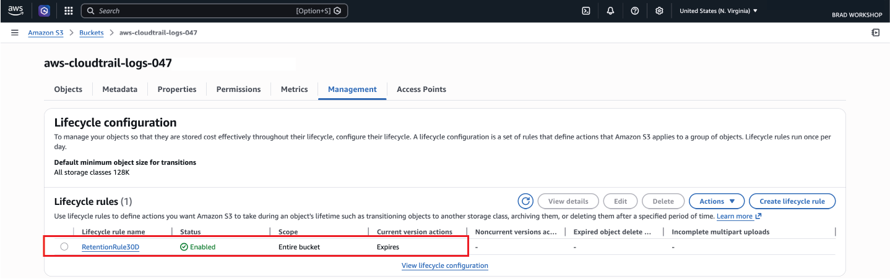

# AWS Account-Level Security Hardening

This project establishes a secure identity and governance baseline in AWS before deploying infrastructure. It focuses on account-Level Security Hardening Before Infrastructure Deployment (IAM, RBAC, MFA, CloudTrail)

The objective is to eliminate permanent administrative access, enforce MFA-based privilege elevation, and implement audit visibility using CloudTrail.

## Security Objectives

- Harden the root account
- Remove direct administrative access from users
- Implement role-based access control (RBAC)
- Enforce MFA for privilege elevation
- Enable CloudTrail logging with lifecycle retention
- Reduce blast radius of credential compromise

## Architecture Summary

The architecture separates identity from privilege:

- Root account (break-glass only)
- IAM users for authentication
- Groups for delegation
- Roles for temporary privilege
- Policies defining permission boundaries
- CloudTrail for auditing

_(Architecture diagram will be added.)_

## Root Hardening

- MFA enabled
- No access keys
- Not used for daily operations
- CloudTrail enabled before IAM configuration

## Role-Based Access Control (RBAC)

Users do not have direct administrative permissions.

Groups are granted `sts:AssumeRole` permission to elevate into privileged roles.

Administrative privileges are attached only to roles.

### Group AssumeRole Policy

## MFA-Enforced Privilege Elevation

Administrative role assumption requires MFA via trust policy condition.

This prevents privilege escalation via credential theft.

## Validation Testing

### Direct Access Attempt

User attempted to create S3 bucket without assuming role.

Result: Access Denied.

### Role Assumption

User assumed CloudSecurityAdminRole and successfully performed administrative actions.

## Logging & Governance

CloudTrail was enabled to ensure audit visibility of identity changes.

- Management events enabled
- Log file validation enabled
- 30-day lifecycle retention policy configured

## Key Security Principle

Separation of authentication and authorization through temporary, MFA-enforced role-based access control to minimize blast radius and eliminate permanent administrative exposure.

## Production Improvements

For enterprise environments:

- Replace IAM users with IAM Identity Center (SSO)
- Restrict trust policies to specific principals
- Implement Service Control Policies (SCPs)
- Shorten session duration
- Centralize logging across multiple accounts
